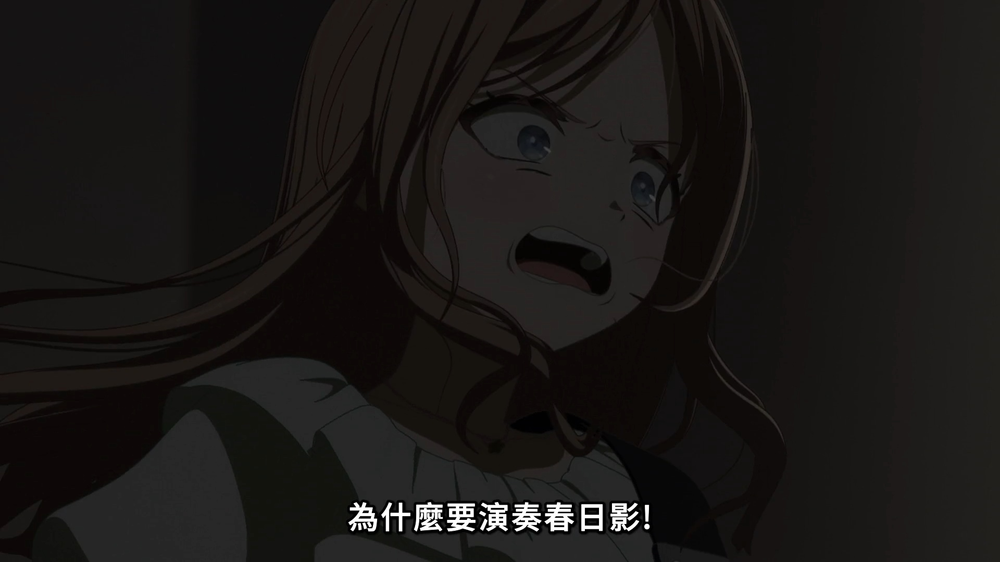
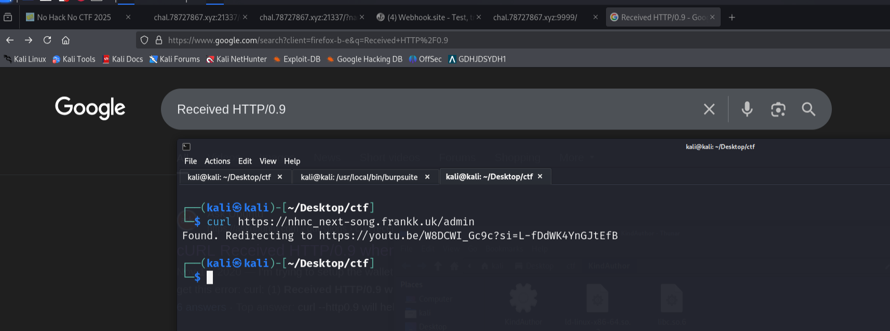
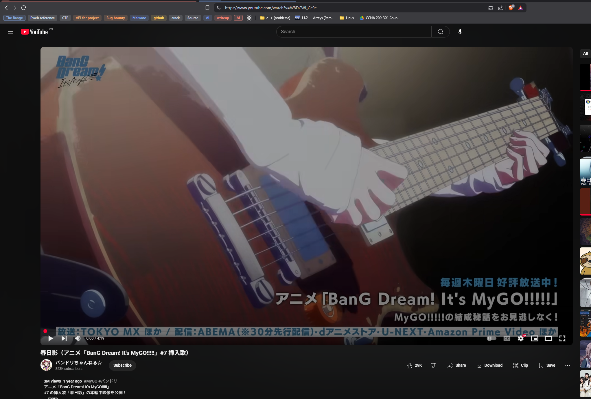
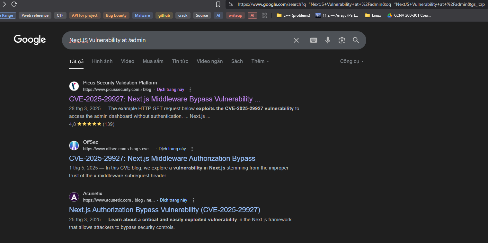
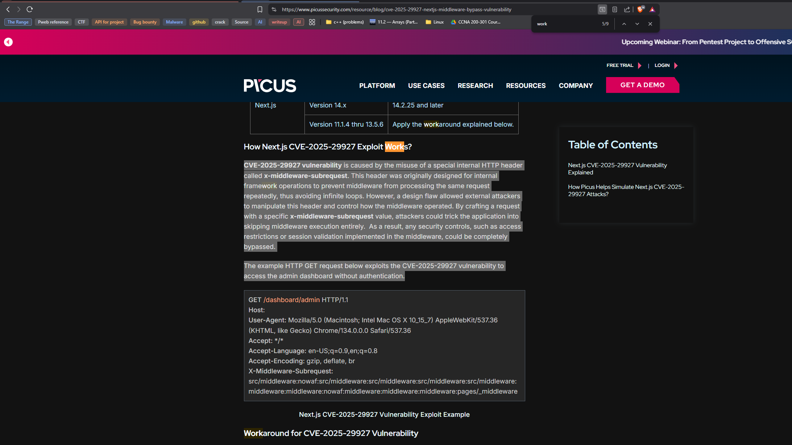
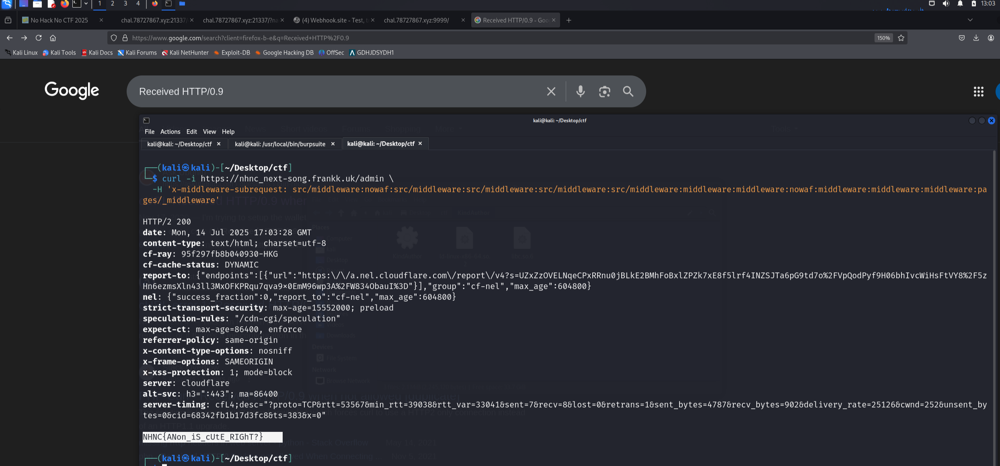

# Next Song is 春日影 - Writeup

## Description

“NextJS Vulnerability at /admin”

`Author: Frank`

[https://nhnc\_next-song.frankk.uk](https://nhnc_next-song.frankk.uk/)

  

A little curious, I clicked the link with the hope that its not “never gonna give u up”.

okayy, so whats now.

Hmm. It's redirecting me to a YouTube video. Probably a **decoy** — redirection is often used to mislead or prevent unauthorized access. Plus, I got the description from the start “NextJS Vulnerability at /admin”. So I searched it, it matches, what is happening in the challenge.

[https://www.picussecurity.com/resource/blog/cve-2025-29927-nextjs-middleware-bypass-vulnerability](https://www.picussecurity.com/resource/blog/cve-2025-29927-nextjs-middleware-bypass-vulnerability)

just copy and paste the `X-Middleware-Subrequest: src/middleware:nowaf:src/middleware:src/middleware:src/middleware:src/middleware:middleware:middleware:nowaf:middleware:middleware:middleware:pages/_middleware`

then I got the flag.

