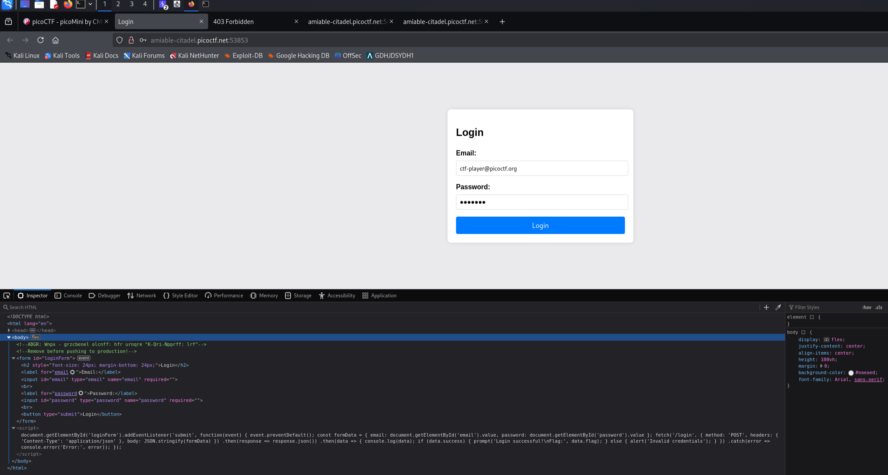
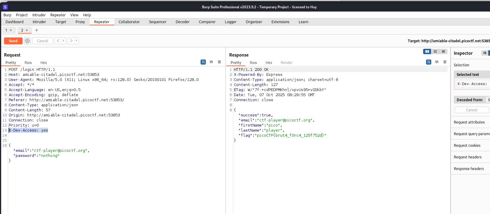

# Crack the Gate 1

**Author:** Yahaya Meddy

---

## Description

We're in the middle of an investigation. One of our persons of interest, CTF player, is believed to be hiding sensitive data inside a restricted web portal. We've uncovered the email address he uses to log in: `ctf-player@picoctf.org`. Unfortunately, we don't know the password, and the usual guessing techniques haven't worked. But something feels off... it's almost like the developer left a secret way in. Can you figure it out?

Additional details will be available after launching your challenge instance.

---

## Solution

### Step 1: Investigating the Source Code

While inspecting the web portal, I found something weird in the HTML comments.

The comment contains a ROT13-encoded note. After decoding it:

> **"NOTE: Jack – temporary bypass: use header 'X-Dev-Access: yes'"**

---

### Step 2: Understanding the Bypass

**Explanation:** If an HTTP request includes the header `X-Dev-Access: yes`, the server will treat the requester as permitted, likely bypassing authentication or enabling developer features.

---

### Step 3: Exploiting the Bypass

By adding the custom HTTP header `X-Dev-Access: yes` to our request, we can bypass the authentication mechanism and access the restricted portal.

---

## Flag

Successfully retrieved the flag by exploiting the developer bypass header.