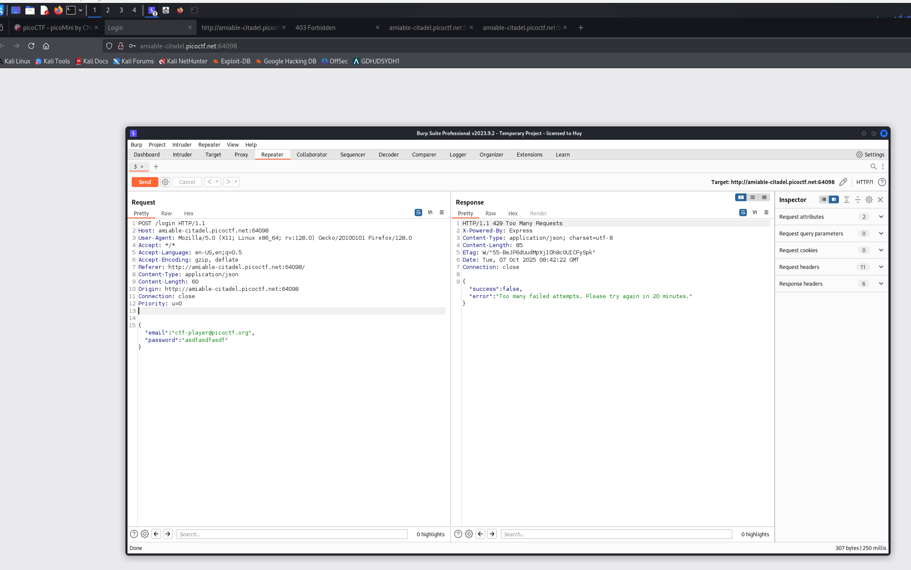
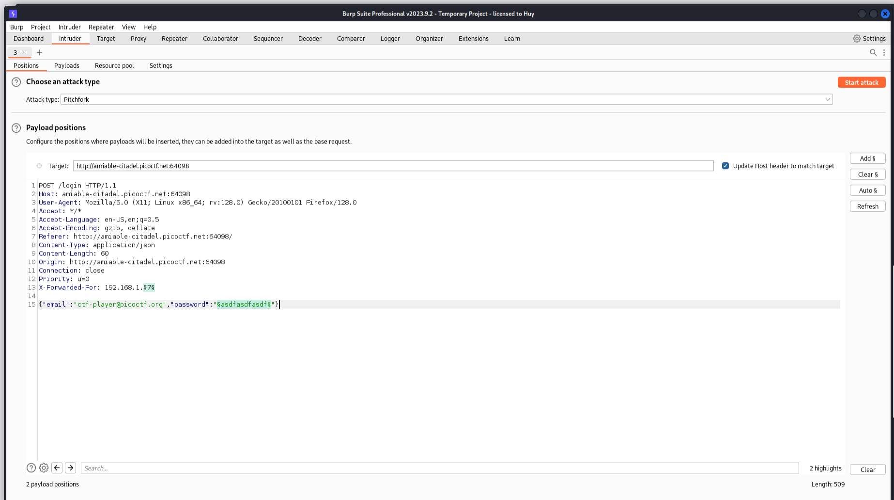
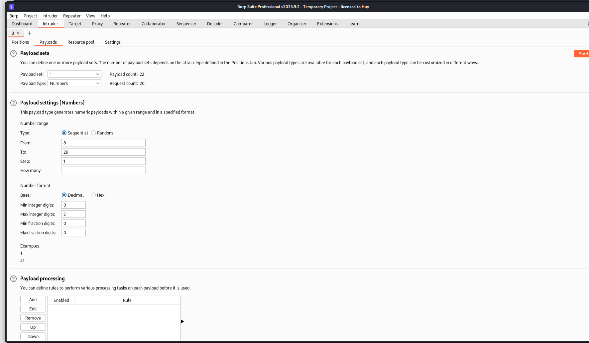
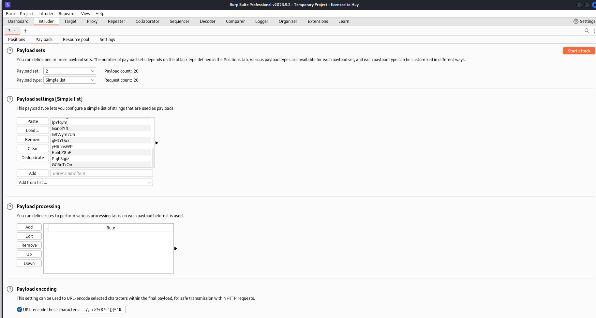
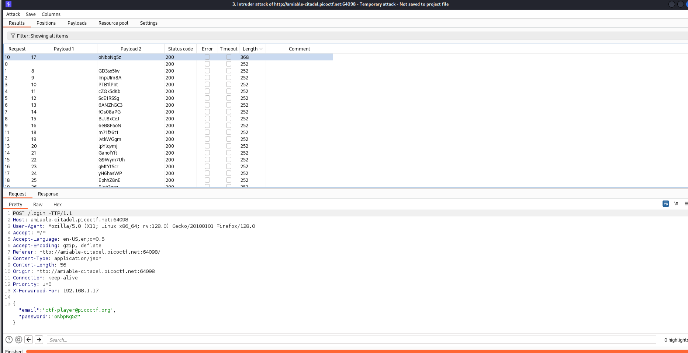
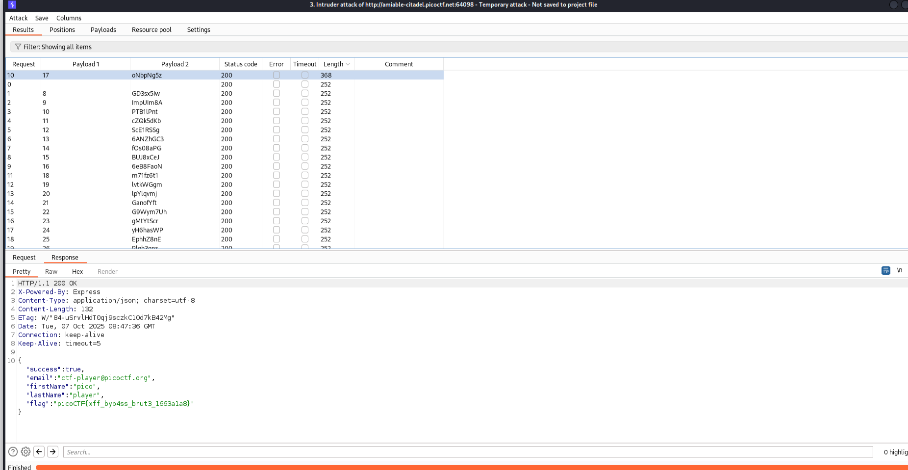

# Crack the Gate 2

**Author:** Yahaya Meddy

---

## Description

The login system has been upgraded with a basic rate-limiting mechanism that locks out repeated failed attempts from the same source. We've received a tip that the system might still trust user-controlled headers. Your objective is to bypass the rate-limiting restriction and log in using the known email address: **ctf-player@picoctf.org** and uncover the hidden secret.

Additional details will be available after launching your challenge instance.

---

## Solution

### Step 1: Password List

We have a list of potential passwords to test:

```
GD3sx5Iw
ImpUIm8A
PTB1lPnt
cZQk5dKb
ScE1RSSg
6ANZhGC3
fOs08aPG
BUJ8xCeJ
6eB8FaoN
oNbpNg5z
m71fz6t1
lvtkWGgm
lpYlqvmj
GanofYft
G9Wym7Uh
gMtYtScr
yH6hasWP
EphhZ8nE
Plgh3qpz
GC6nTzOn
```

---

### Step 2: Identifying Rate Limiting

After 2 login attempts, the system returns an error:

```json
{
  "error": "Too many failed attempts. Please try again in 20 minutes."
}
```



---

### Step 3: Bypassing Rate Limiting

To bypass the rate-limiting mechanism, we can use the `X-Forwarded-For` header with random IP addresses. This header is trusted by the server to identify the client's IP address, allowing us to appear as different sources for each request.







---

### Step 4: Analyzing Responses

After sending requests with different passwords and spoofed IPs, we analyze the responses to find the correct password by checking for the highest response length (which typically indicates a successful login with more data returned).





---

